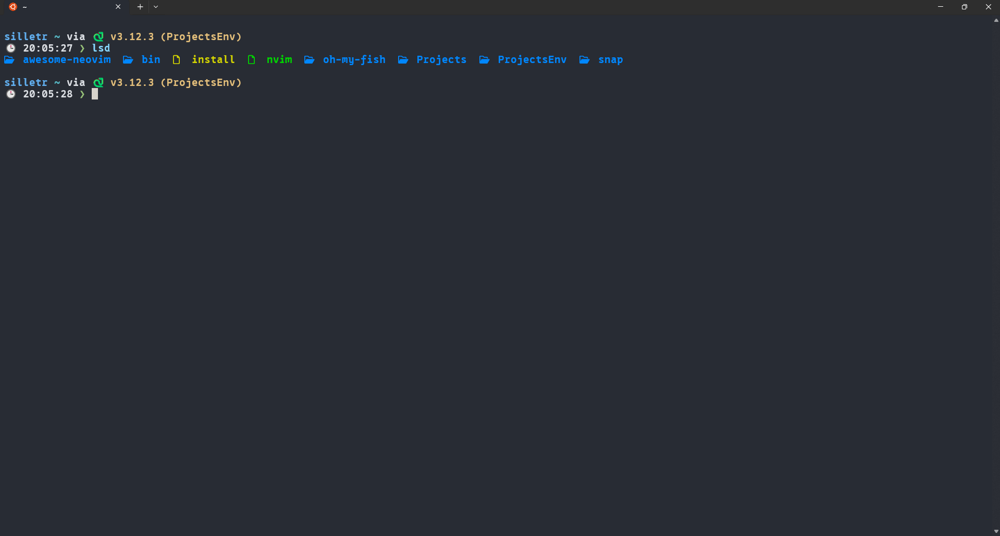

<h1 align="center">👋 Hey there! I'm Igor</h1>

  <i>Ukrainian coder, deathcore enjoyer, extreme vocal wannabe</i> 

   
   
  

---

<h2 align="center">🖥️ My Stack</h2>

  
  
  
  
  

  <bold>Neofetch:</bold>
  

---

<h2 align="center">🔥 Projects</h2>

<table align="center">
  <tr>
    <td align="center">
      
       <b>LazyDeveloperHelper</b> — most active
    </td>
    <td align="center">
      
       <b>Rython</b> — my own language (Rust + Python)
    </td>
    <td align="center">
      
       <b>SilletrJack</b> — active #3
    </td>
  </tr>
</table>

---

<h2 align="center">📊 GitHub Stats</h2>

  
  

  

---

<h2 align="center">📧 Contact</h2>

  
  

  <i>"Less sleep, more code. Less routine, more breakdowns."</i> 🗿

